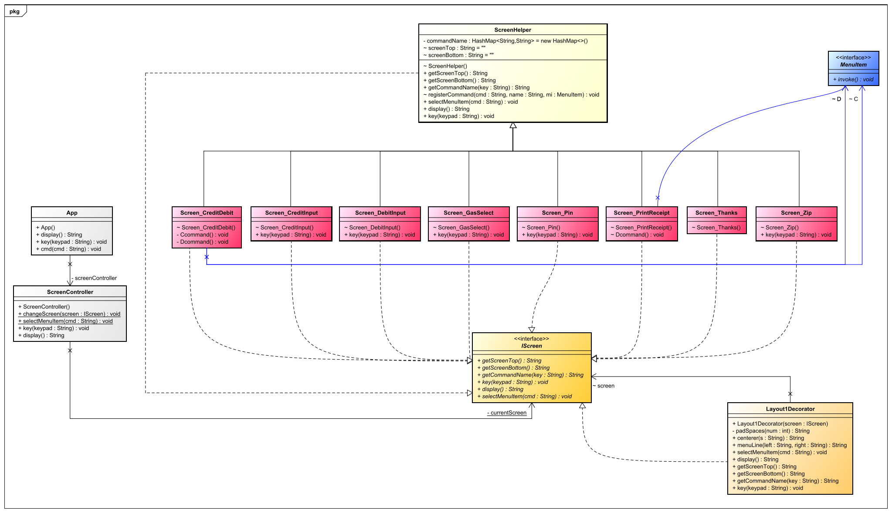
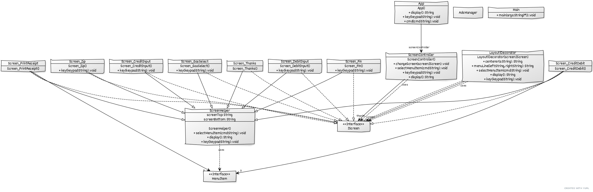

# Gaspump

## Design Features:

 - Follows command pattern to invoke command on each screen
	 - commands are decoupled on each screen for more flexibility.
<br >
- Screen change is done using state pattern.
	- A central class - ScreenController manages the currentScreen state, which contains the reference to current screen object. Any registered class can change the currentScreen state to next.
<br >
- Decorator pattern is used to generate the screen layout as per spec.
<br >
- Pattern that can be implemented if scope of project is increased
	- Keypad may use Observer pattern to send key event updates to multiple classes requiring that.
	- State Chain can be implemented to go forward and backward on screens with just next() or prev() but would reduce flexibility

## Design of the framework

<br />
<br />
<br />

Class diagram **generated from UMLParser project.**
<br />
<br />
 - **App** takes cmd() and keypad() commands from Main() and has a reference to **ScreenController** which manages the state of current screen.

- **ScreenController** manages the stateMachine for screen routing. It has a reference to all the screens and can  take command from a screen to change the screen.

- Each screen implements **IScreen** and can extend **ScreenHelper** class wich provides helper functions for registering commands, invoking them and screen name for them.

- Layout1Decorator decorates the display() for a screen as per the project spec.
	- Layout1Decorator is only compactible with ScreenHelper class for now.

<br />
<br />

This project's framework is designed keeping in mind future maintainability & ease of usage.
## How to add a screen 

 1. Create a class that   `extends ScreenHelper implements IScreen`.
	 - It is recommended that class starts with `Screen_` 
	  <br />
 2. Follow this doc for helper functions.
	 ```java 
	 /**  
	 * Add sceen demo
	 *  
	 */
	 * public class Screen_demo extends ScreenHelper implements IScreen {   // ScreenHelper is optional but then Layout1Decorator wont work and need to add your display logic.
	  
		  /**  
		 * Instantiates a new demo screen.
		 * 
		 */  
		 Screen_CreditDebit()  
		 {  
		  super.screenTop = "demo screen";  // To print on top of commands.
		  super.screenBottom -= "Extra text"; // optional. By default random ad is printed
		  registerCommand("C", "DemoCommand", C);   // Register a command at C named DemoCommand which will invoke object C(defined below).
		 }  
		 
		  /**  
		 * Binds Ccommand() to MenuItem.invoke() 
		 * Just a syntax sugar using labda. Can add more code to id*/  
		  MenuItem C = () -> Ccommand();  
		  private void Ccommand() { ScreenController.changeScreen(ScreenController.demo2); } // Change to demo2 screen.
	}
	 ```
3. Instantiate your Screen class in ScreenController
	```java 
	ScreenContoller()
	{
		demo = new Layout1Decorator(new Screen_demo());
	}
	```